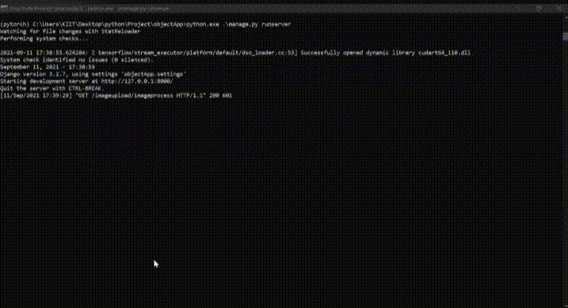

# Web application for Object Identification using ResNet50

A web application where one can upload image as per ones wish and application will response with what are the object present in the image using the imagenet classification of predefined models. 

# Required dependency
- Anaconda 3.6
- Keras

# ResNet50
[ResNet50](https://keras.io/api/applications/) is a variant of ResNet model which has 48 Convolution layers along with 1 MaxPool and 1 Average Pool layer.

# Installation

Install Keras:
> For Backend
```
pip install kera
```
Install Tensorflow:
```
pip intall tensorflow
```
Install django:
> For Frontend
```
pip install django
```

# Getting started

Creating Django project:
```python
django-admin.exe startproject ObjectApp
cd .\objectApp\
```
Running the webserver:
```python
python.exe .\manage.py runserver
```
Local host:
```
localhos:8000/imageupload
```
Adding features:
```python
python.exe .\manage.py startapp imgUpload
```
Image classification model using pretrained keras ResNet50 model:

[Classify ImageNet classes with ResNet50](https://keras.io/api/applications/)





Thank You !

